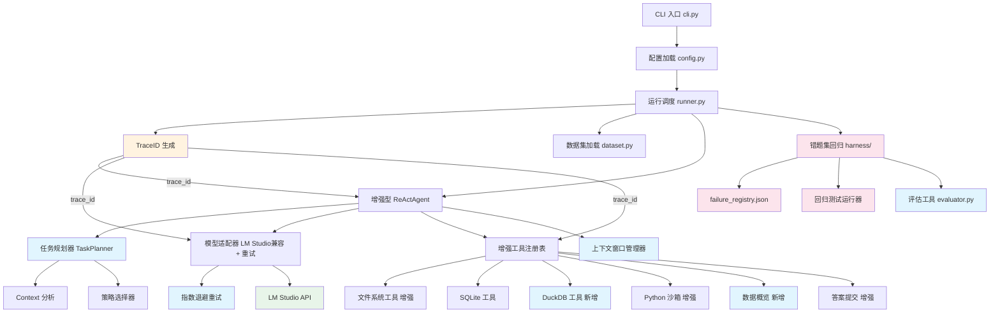
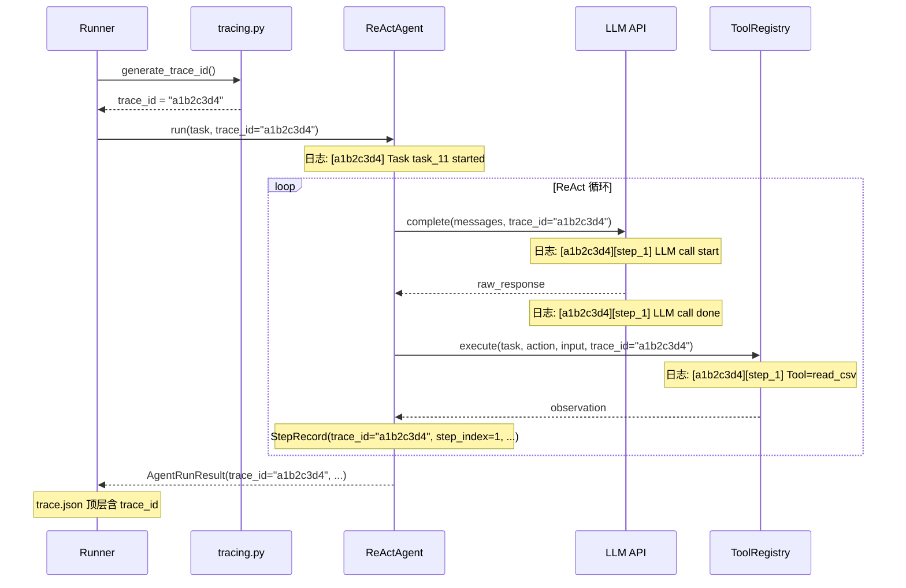
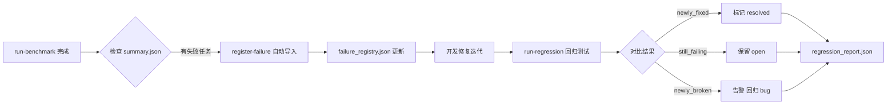

## 产品概述

基于 KDD Cup 2026 DataAgent-Bench 比赛的官方 Starter Kit，对现有 ReAct 风格数据分析 Agent 进行全面升级改造。目标是构建一个高效、稳定、可追踪的智能代理系统，能够处理 4 个难度级别（easy/medium/hard/extreme）的数据分析任务，覆盖 CSV/JSON/SQLite/Markdown 等异构数据源，最大化任务完成率与答案准确率。

## 核心功能

1. **LM Studio 局域网模型兼容**：支持通过局域网调用另一台电脑上 LM Studio 部署的模型，允许 api_key 为空/占位符，增加连接超时和重试配置，提供 LM Studio 专用配置示例
2. **全链路 TraceID 追踪**：每个任务运行生成唯一 trace_id，贯穿 Agent 初始化、每个 ReAct step、每次 LLM 调用、每次工具执行，trace_id 写入 trace.json 并在日志输出中体现，辅助快速回溯和定位错误步骤
3. **Harness Engineering 错题集回归测试**：维护 failure_registry.json 管理未通过样例的错误集，每次迭代后对错题集进行回归测试，确保已修复问题不再出现回归；支持 CLI 命令注册错题、运行回归、对比前后结果
4. **增强型提示词工程**：设计分难度级别的系统提示词，包含数据分析策略指导、knowledge.md 优先读取规则、答案格式规范
5. **任务规划与分析预处理**：在 ReAct 循环前增加自动化的任务分析阶段，根据 context 文件类型和数据规模自动制定分析策略
6. **工具系统扩展**：新增 DuckDB 高性能查询工具、数据概览工具、CSV 分页读取，增强 execute_python 超时配置
7. **模型调用韧性**：为 LLM API 调用增加指数退避重试机制、响应解析容错与自动修复、上下文窗口管理与消息截断策略
8. **本地评估系统**：实现 prediction.csv 与 gold.csv 的精确匹配和模糊匹配对比，输出每任务得分和整体准确率

## 技术栈

- **语言与运行时**：Python >= 3.10（保持现有选择）
- **LLM 接口**：openai >= 2.28.0（OpenAI-compatible API，天然支持 LM Studio）
- **数据处理**：pandas >= 2.3.3 / polars >= 1.39.0 / duckdb >= 1.5.0（均已安装但 duckdb 未使用）
- **数据库**：sqlite3（内置）+ duckdb（新增利用）
- **序列化**：pyarrow / openpyxl（已安装未使用）
- **CLI 框架**：typer + rich（保持现有）
- **配置管理**：pyyaml + dataclass（保持现有模式）
- **追踪**：uuid（标准库，生成 trace_id）
- **依赖管理**：uv + hatchling（保持现有）

## 实现方案

### 总体策略

在现有 ReAct Agent 架构基础上，通过 **8 层增强** 构建竞赛级智能代理系统：LM Studio 兼容层、全链路追踪层、错题集回归层、提示词工程层、任务规划层、工具能力层、模型韧性层、评估验证层。所有改造保持向后兼容，不破坏现有 CLI 接口和配置结构。

### 关键技术决策

1. **保持 ReAct 范式不变**：ReAct 是比赛 baseline 的核心架构，在此基础上增强而非替换
2. **LM Studio 天然兼容**：现有 `OpenAIModelAdapter` 使用 `openai` SDK 的 `base_url` 参数，LM Studio 暴露 OpenAI-compatible API（`http://192.168.x.x:1234/v1`），架构天然支持。关键改造点：(a) 移除 `api_key` 为空时的 RuntimeError（LM Studio 不验证 key）；(b) 每次 `complete()` 调用都新建 `OpenAI` client 需改为构造时创建并复用；(c) 增加 `ConnectionError`/`Timeout` 的捕获和重试
3. **TraceID 设计**：使用 `uuid4` 短格式（前 8 位）作为 trace_id，在 `runner.py` 任务入口处生成，通过参数逐层传递至 `ReActAgent.run()` -> `model.complete()` -> `tools.execute()`，最终写入 `StepRecord` 和 `AgentRunResult`
4. **错题集设计**：`harness/failure_registry.json` 存储结构化失败记录（task_id, failure_reason, first_seen, last_run_id），CLI 提供 `register-failure` / `run-regression` / `diff-results` 命令
5. **充分利用已安装依赖**：duckdb、polars、openpyxl 均已在 pyproject.toml 中但未使用，可直接利用

## 实现细节

### 1. LM Studio 局域网兼容

**关键修改文件**：`agents/model.py`、`config.py`、`configs/`

- `OpenAIModelAdapter.__init__` 中构造时创建 `OpenAI` client 并复用（当前每次 `complete()` 都新建），增加 `timeout` 和 `max_retries` 参数传递给 `openai.OpenAI()` 构造函数
- 移除 `complete()` 中 `if not self.api_key: raise RuntimeError(...)` 限制，改为：当 `api_key` 为空时默认使用 `"lm-studio"` 作为占位符（LM Studio 接受任意 key）
- 增加 `openai.APIConnectionError`、`openai.APITimeoutError`、`openai.RateLimitError` 的分类捕获，结合指数退避重试
- `AgentConfig` 新增 `max_retries: int = 3`、`request_timeout: int = 120`、`connection_timeout: int = 30` 字段
- 新增 `configs/lm_studio.example.yaml` 配置示例，`api_base` 示例为 `http://192.168.1.100:1234/v1`，`api_key` 为 `lm-studio`

### 2. 全链路 TraceID 追踪

**关键修改文件**：`agents/tracing.py`（新建）、`agents/runtime.py`、`agents/react.py`、`agents/model.py`、`tools/registry.py`、`run/runner.py`

- 新建 `agents/tracing.py` 提供 `generate_trace_id() -> str`（uuid4 前 8 位）和 `TraceContext` dataclass（trace_id + task_id + 创建时间戳）
- `StepRecord` 新增 `trace_id: str` 字段，`AgentRunResult.to_dict()` 输出中包含顶层 `trace_id`
- `ReActAgent.run()` 接受 `trace_id: str | None = None` 参数，若未传入则自动生成；每个 step 的日志输出带 `[trace_id][step_N]` 前缀
- `OpenAIModelAdapter.complete()` 接受可选 `trace_id` 参数，在请求异常时日志包含 trace_id 辅助定位
- `ToolRegistry.execute()` 接受可选 `trace_id` 参数，工具执行异常时在 observation 中附带 trace_id
- `runner.py` 的 `run_single_task` 生成 trace_id 后传入 Agent，trace.json 顶层增加 `trace_id` 字段
- 使用 `rich.console.Console` 的日志输出（已有依赖），关键事件（LLM 调用开始/结束、工具调用、错误）带 trace_id 前缀打印

### 3. Harness Engineering 错题集回归测试

**关键新建文件**：`harness/failure_registry.py`、`harness/regression.py`

- `failure_registry.json` 存储于 `artifacts/harness/` 目录，结构：

```
{
  "failures": [
    {
      "task_id": "task_11",
      "difficulty": "easy",
      "failure_reason": "Agent did not submit an answer within max_steps.",
      "first_seen_run_id": "20260402T150000Z",
      "first_seen_at": "2026-04-02T15:00:00Z",
      "status": "open",
      "notes": ""
    }
  ]
}
```

- `FailureRegistry` 类：`load()` / `save()` / `register(task_id, reason, run_id)` / `mark_resolved(task_id)` / `get_open_failures() -> list`
- `RegressionRunner`：从 registry 读取所有 open 状态的 failure task_ids，运行这些任务，对比结果，输出回归报告（哪些修复了、哪些仍失败、哪些新增失败）
- 回归结果写入 `artifacts/harness/regression_<run_id>.json`，包含 `newly_fixed` / `still_failing` / `newly_broken` 三个列表
- CLI 新增命令：`register-failure`（手动注册或从 summary.json 自动导入失败用例）、`run-regression`（运行回归测试）、`regression-report`（展示回归结果对比）

### 4. 提示词增强

**关键修改文件**：`agents/prompt.py`

- 新增 `ENHANCED_SYSTEM_PROMPT`，包含 10 条分析策略规则（优先读 knowledge.md、先 list_context、大文件用 Python/DuckDB 处理等）
- 按难度级别提供差异化指导函数 `build_difficulty_hints(difficulty: str) -> str`
- `build_task_prompt` 增强版注入 context 文件结构摘要，减少不必要的 list_context 调用

### 5. 任务规划预处理

**关键新建文件**：`agents/planner.py`

- `TaskPlanner.analyze(task) -> TaskPlan`：扫描 context 目录文件类型与大小、读取 knowledge.md 前 2000 字符、根据难度生成初始分析计划
- `TaskPlan` dataclass 包含：context_summary / knowledge_summary / data_modalities / recommended_tools / strategy_hint / adaptive_max_steps / python_timeout
- 将计划注入第一条 user message，引导 LLM 按计划执行

### 6. 工具系统扩展

**关键修改/新建文件**：`tools/duckdb_tools.py`（新建）、`tools/filesystem.py`、`tools/python_exec.py`、`tools/sqlite.py`、`tools/registry.py`

- 新增 `execute_duckdb_sql` 工具：直接用 DuckDB 查询 CSV/JSON/Parquet 文件
- 新增 `data_profile` 工具：快速获取文件行数/列数/列类型/基础统计
- `read_csv_preview` 增加 `offset` 分页参数
- `execute_python_code` 超时可配置化（从 30s 提升为按难度自适应）
- `inspect_sqlite_schema` 增加各表行数统计
- 更新 `create_default_tool_registry()` 注册新工具，增强所有工具的 description

### 7. 上下文窗口管理与模型韧性

**关键新建文件**：`agents/context_manager.py`

- `ContextWindowManager`：token 估算（按字符数 / 4 近似）、历史消息压缩（保留最近 N 步完整 observation，早期步只保留 thought+action 摘要）、observation 截断（超 8000 字符自动截断并标注）
- `parse_model_step()` 增加容错：处理常见格式偏差（多余文本包裹、key 大小写不一致、缺少 action_input 等）
- ReAct 循环中解析失败时，将错误反馈给 LLM 要求重新输出（最多 2 次重试），而非直接记录 `__error__`

### 8. 本地评估系统

**关键新建文件**：`evaluation/evaluator.py`

- 对比 prediction.csv 与 gold.csv：精确匹配（字符串完全一致）+ 模糊匹配（数值容差 1e-6、字符串归一化 strip/lower）
- 输出每任务得分（0/1）和整体准确率
- 可通过 CLI `evaluate` 命令调用

## 架构设计

### 系统架构



### 全链路 TraceID 传递流



### 错题集回归测试流程



## 目录结构

```
src/data_agent_baseline/
├── __init__.py
├── cli.py                          # [MODIFY] 增加 evaluate/register-failure/run-regression/regression-report 命令，增加 --difficulty 过滤参数
├── config.py                       # [MODIFY] AgentConfig 新增 max_retries/request_timeout/connection_timeout 字段；新增 HarnessConfig 配置项
├── agents/
│   ├── __init__.py                 # [MODIFY] 导出新增模块 tracing/planner/context_manager
│   ├── model.py                    # [MODIFY] OpenAIModelAdapter: 构造时创建 client 复用、api_key 为空时使用占位符、增加 timeout/max_retries 参数、分类异常捕获 + 指数退避重试、complete() 接受可选 trace_id 参数用于日志输出
│   ├── prompt.py                   # [MODIFY] 新增 ENHANCED_SYSTEM_PROMPT（10 条策略规则）、build_difficulty_hints() 按难度生成差异化提示、增强 build_task_prompt() 注入 context 摘要
│   ├── react.py                    # [MODIFY] ReActAgent.run() 接受 trace_id 参数、集成 TaskPlanner 预处理、解析失败自动重试（最多 2 次反馈 LLM 重新生成）、集成上下文窗口管理器、StepRecord 携带 trace_id
│   ├── runtime.py                  # [MODIFY] StepRecord 新增 trace_id 字段；AgentRunResult.to_dict() 输出顶层 trace_id；AgentRuntimeState 增加 retry_count/plan 字段
│   ├── tracing.py                  # [NEW] 全链路追踪模块：generate_trace_id() 生成 uuid4 短格式；TraceContext dataclass（trace_id/task_id/created_at）；trace_log() 结构化日志输出函数，格式为 [trace_id][step_N][component] message
│   ├── planner.py                  # [NEW] 任务规划器：TaskPlan dataclass、TaskPlanner.analyze() 扫描 context 目录文件类型与大小、预读 knowledge.md、根据难度+数据模态生成分析计划和推荐工具序列
│   └── context_manager.py          # [NEW] 上下文窗口管理器：token 估算（字符数/4）、历史消息压缩（保留最近 N 步完整、早期步摘要化）、observation 截断（超 8000 字符时截断并标注）
├── benchmark/
│   ├── __init__.py                 # [MODIFY] 导出 AnswerTable
│   ├── dataset.py                  # 保持不变
│   └── schema.py                   # [MODIFY] AnswerTable 增加 validate() 方法：列名非空检查、行列匹配检查、数值格式标准化
├── tools/
│   ├── __init__.py                 # [MODIFY] 导出新增 duckdb_tools 模块
│   ├── registry.py                 # [MODIFY] 注册 execute_duckdb_sql 和 data_profile 新工具；execute() 接受可选 trace_id 参数；增强所有工具的 description 和 input_schema；Python 超时可配置化
│   ├── filesystem.py               # [MODIFY] read_csv_preview 增加 offset 分页参数；read_json_preview 对数组型 JSON 返回 schema 信息；read_doc_preview 增加 offset 分段参数
│   ├── python_exec.py              # [MODIFY] execute_python_code 超时参数外部可配置（默认提升至 60s）；沙箱命名空间注入 pandas/duckdb 引用减少 import 开销
│   ├── sqlite.py                   # [MODIFY] inspect_sqlite_schema 增加各表 row_count 统计；execute_read_only_sql 增加查询超时保护
│   └── duckdb_tools.py             # [NEW] DuckDB 高性能查询工具：execute_duckdb_sql 直接查询 CSV/JSON/Parquet 文件、data_profile 提供文件快速概览（行数/列数/列类型/NULL 比例/基础统计）
├── harness/
│   ├── __init__.py                 # [NEW] 导出 FailureRegistry、RegressionRunner
│   ├── failure_registry.py         # [NEW] 错题集管理：FailureRegistry 类 load/save/register/mark_resolved/get_open_failures；failure_registry.json 持久化存储
│   └── regression.py               # [NEW] 回归测试运行器：RegressionRunner 读取 open failures 列表、运行这些任务、对比结果生成 newly_fixed/still_failing/newly_broken 报告
├── evaluation/
│   ├── __init__.py                 # [NEW] 导出 evaluate_run
│   └── evaluator.py                # [NEW] 本地评估：对比 prediction.csv 与 gold.csv，精确匹配 + 模糊匹配（数值容差/字符串归一化），输出每任务得分和整体准确率
├── run/
│   ├── __init__.py                 # [MODIFY] 导出新增函数
│   └── runner.py                   # [MODIFY] run_single_task 生成 trace_id 并传入 Agent；build_model_adapter 传递新增 timeout/retries 参数；集成 TaskPlanner 预处理
└── configs/
    ├── react_baseline.example.yaml # 保持不变
    └── lm_studio.example.yaml      # [NEW] LM Studio 专用配置示例：api_base 为 http://192.168.1.100:1234/v1，api_key 为 lm-studio，request_timeout 为 180
```

### 关键接口定义

```python
# agents/tracing.py - 全链路追踪
@dataclass(frozen=True, slots=True)
class TraceContext:
    trace_id: str
    task_id: str
    created_at: str  # ISO 8601

def generate_trace_id() -> str:
    """生成 uuid4 前 8 位短格式 trace_id"""
    ...

def trace_log(trace_id: str, step: int | None, component: str, message: str) -> None:
    """结构化日志输出: [trace_id][step_N][component] message"""
    ...
```

```python
# agents/planner.py - 任务规划器
@dataclass(frozen=True, slots=True)
class TaskPlan:
    difficulty: str
    context_summary: str
    knowledge_summary: str | None
    data_modalities: list[str]
    recommended_tools: list[str]
    strategy_hint: str
    adaptive_max_steps: int
    python_timeout: int

class TaskPlanner:
    def analyze(self, task: PublicTask) -> TaskPlan: ...
```

```python
# harness/failure_registry.py - 错题集管理
@dataclass(slots=True)
class FailureEntry:
    task_id: str
    difficulty: str
    failure_reason: str
    first_seen_run_id: str
    first_seen_at: str
    status: str  # "open" | "resolved"
    notes: str

class FailureRegistry:
    def load(self, path: Path) -> None: ...
    def save(self, path: Path) -> None: ...
    def register(self, task_id: str, difficulty: str, reason: str, run_id: str) -> None: ...
    def import_from_summary(self, summary_path: Path) -> int: ...
    def mark_resolved(self, task_id: str) -> None: ...
    def get_open_failures(self) -> list[FailureEntry]: ...
```

```python
# harness/regression.py - 回归测试
@dataclass(frozen=True, slots=True)
class RegressionReport:
    run_id: str
    total_tested: int
    newly_fixed: list[str]
    still_failing: list[str]
    newly_broken: list[str]

class RegressionRunner:
    def run(self, config: AppConfig, registry: FailureRegistry) -> RegressionReport: ...
```

## Agent Extensions

### SubAgent

- **code-explorer**
- 用途：在实施各模块开发时，搜索跨文件依赖关系、确认接口调用链路、查找需要同步修改的 import 语句和类型引用，确保 trace_id 参数在全链路中正确传递
- 预期结果：确保每次代码修改的完整性，不遗漏关联文件的同步更新，trace_id 贯穿所有调用层级