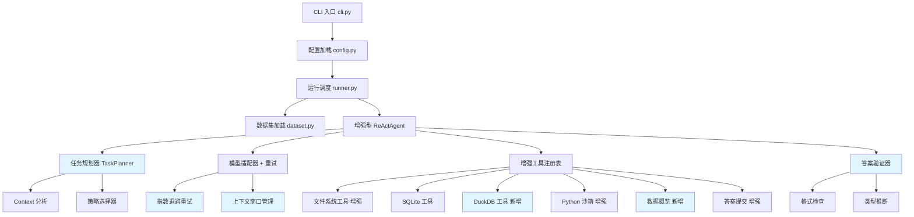
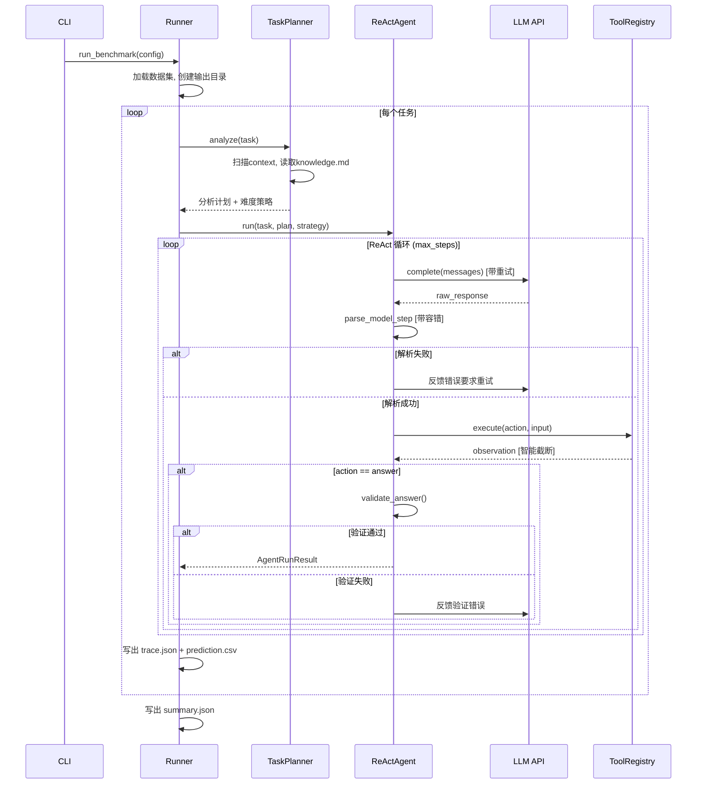

## 产品概述

基于 KDD Cup 2026 DataAgent-Bench 比赛的官方 Starter Kit，对现有 ReAct 风格数据分析 Agent 进行全面升级改造。目标是构建一个高效、稳定的智能代理系统，能够处理 4 个难度级别（easy/medium/hard/extreme）的数据分析任务，覆盖 CSV/JSON/SQLite/Markdown 等异构数据源，最大化任务完成率与答案准确率。

## 核心功能

1. **增强型提示词工程**：设计分难度级别的系统提示词，包含数据分析策略指导、knowledge.md 优先读取规则、答案格式规范，使 Agent 具备更强的推理规划能力
2. **任务规划与分析预处理**：在 ReAct 循环前增加自动化的任务分析阶段，根据 context 文件类型和数据规模自动制定分析策略，实现难度自适应
3. **工具系统扩展**：新增 DuckDB 高性能查询工具、数据摘要/统计工具、CSV 分片读取工具，增强 execute_python 超时配置，提升大数据处理能力
4. **模型调用韧性**：为 LLM API 调用增加指数退避重试机制、响应解析容错与自动修复、上下文窗口管理与消息截断策略
5. **答案验证与自我修复**：在提交答案前自动验证列名匹配、数据类型合理性和行数检查；解析失败时自动重试而非直接记录错误
6. **性能优化与并行调度**：优化 Python 沙箱执行超时配置、观察结果智能截断、上下文历史压缩，确保在 600 秒任务超时内最大化利用时间

## 技术栈

- **语言与运行时**：Python >= 3.10（保持现有选择）
- **LLM 接口**：openai >= 2.28.0（OpenAI-compatible API）
- **数据处理**：pandas >= 2.3.3 / polars >= 1.39.0 / duckdb >= 1.5.0（项目已安装但 duckdb 未被使用）
- **数据库**：sqlite3（内置）+ duckdb（新增利用）
- **序列化**：pyarrow / openpyxl（项目已安装但未被使用）
- **CLI 框架**：typer + rich（保持现有）
- **配置管理**：pyyaml + dataclass（保持现有模式）
- **依赖管理**：uv + hatchling（保持现有）

## 实现方案

### 总体策略

在现有 ReAct Agent 架构基础上，通过 **6 层增强** 构建竞赛级智能代理系统：提示词工程层、任务规划层、工具能力层、模型韧性层、答案验证层、性能优化层。所有改造均保持向后兼容，不破坏现有 CLI 接口和配置结构。

### 关键技术决策

1. **保持 ReAct 范式不变**：ReAct 是比赛 baseline 的核心架构，在此基础上增强而非替换，降低风险
2. **充分利用已安装依赖**：duckdb、polars、openpyxl 均已在 pyproject.toml 中但未使用，可直接利用
3. **分难度自适应策略**：根据 task.json 的 difficulty 字段动态调整 max_steps、Python 超时、提示词策略
4. **execute_python 作为万能后备**：大多数复杂分析最终都通过 Python 代码执行，需确保 Python 沙箱可靠性

## 实现细节

### 1. 提示词增强要点

- 在 `prompt.py` 中新增 `ENHANCED_SYSTEM_PROMPT`，包含 10 条分析策略规则（优先读 knowledge.md、先 list_context 了解全局、大文件用 Python/DuckDB 处理等）
- 按难度级别提供差异化指导：easy 偏向直接 Python 分析，medium 偏向 SQL 查询，hard/extreme 偏向分块读取+推理
- `build_task_prompt` 中注入 context 文件结构摘要，减少不必要的 list_context 调用

### 2. 任务规划预处理要点

- 新增 `TaskPlanner` 类，在 ReActAgent.run() 前执行：扫描 context 目录文件类型与大小、读取 knowledge.md、根据难度生成初始分析计划
- 将计划注入第一条 user message，引导 LLM 按计划执行
- 对 extreme 任务启用分块读取策略

### 3. 工具系统扩展要点

- 新增 `execute_duckdb_sql` 工具：直接用 DuckDB 查询 CSV/JSON/Parquet 文件，避免先加载到内存
- 增强 `read_csv`：增加 `offset` 参数支持分页读取，增加 `columns` 参数支持列筛选
- 增强 `read_json`：对数组型 JSON 返回 schema 信息和前 N 条记录
- `execute_python` 超时从 30s 提升至可配置（easy: 60s, medium: 90s, hard/extreme: 120s）
- 新增 `data_profile` 工具：快速获取文件的行数、列数、列类型、基础统计

### 4. 模型韧性要点

- `OpenAIModelAdapter.complete()` 增加最多 3 次指数退避重试（1s/2s/4s）
- `parse_model_step()` 增加容错：处理 LLM 常见格式偏差（多余文本包裹、key 大小写、缺少 action_input 等）
- ReAct 循环中解析失败时，不再直接记录 `__error__`，而是将错误反馈给 LLM 要求重新输出
- 增加上下文窗口管理：当累计 messages token 数接近模型上限时，自动压缩早期 observation

### 5. 答案验证要点

- 在 `_answer` handler 中增加预提交验证：列名非空检查、行数合理性检查、数值格式标准化
- 新增 `validate_and_answer` 工具作为 `answer` 的增强替代，包含自动类型推断和格式化

### 6. 性能优化要点

- Observation 结果智能截断：超过 8000 字符时自动摘要，避免撑爆上下文窗口
- 对大型 SQL 查询结果和 Python 输出进行截断和摘要
- 多 worker 并行时，每个 worker 复用 OpenAI client 连接（避免重复创建）
- 配置 `max_steps` 按难度自适应：easy=12, medium=20, hard=28, extreme=32

## 架构设计

### 系统架构



### 数据流



## 目录结构

```
src/data_agent_baseline/
├── __init__.py
├── cli.py                          # [MODIFY] 增加 --difficulty 过滤参数和评估命令
├── config.py                       # [MODIFY] 新增 PlannerConfig 配置项，扩展 AgentConfig 增加 max_retries/adaptive_steps 等字段
├── agents/
│   ├── __init__.py                 # [MODIFY] 导出新增模块
│   ├── model.py                    # [MODIFY] OpenAIModelAdapter 增加指数退避重试（max_retries=3），增加 token 计数方法
│   ├── prompt.py                   # [MODIFY] 新增 ENHANCED_SYSTEM_PROMPT 和按难度级别的策略提示词模板，增强 build_task_prompt 注入 context 摘要
│   ├── react.py                    # [MODIFY] ReActAgent 核心增强：集成 TaskPlanner 预处理、解析失败自动重试（而非记录__error__）、上下文窗口管理和消息压缩、难度自适应 max_steps
│   ├── runtime.py                  # [MODIFY] AgentRuntimeState 增加 retry_count/plan 字段
│   ├── planner.py                  # [NEW] 任务规划器 TaskPlanner：扫描 context 目录结构和文件大小、预读 knowledge.md 摘要、根据难度+数据模态生成分析计划和推荐工具序列
│   └── context_manager.py          # [NEW] 上下文窗口管理器：token 估算、历史消息压缩、observation 摘要生成，确保不超出模型上下文窗口限制
├── benchmark/
│   ├── __init__.py
│   ├── dataset.py                  # 保持不变
│   └── schema.py                   # [MODIFY] AnswerTable 增加 validate() 方法进行预提交校验
├── tools/
│   ├── __init__.py                 # [MODIFY] 导出新增工具模块
│   ├── registry.py                 # [MODIFY] 注册新工具（execute_duckdb_sql、data_profile），增强现有工具描述和 input_schema 使 LLM 更易理解，Python 超时可配置化
│   ├── filesystem.py               # [MODIFY] read_csv_preview 增加 offset/columns 分页和列筛选参数；read_json_preview 增加 schema 模式返回数组型 JSON 的结构信息；read_doc_preview 增加 offset 参数支持分段读取大文档
│   ├── python_exec.py              # [MODIFY] execute_python_code 超时参数外部可配置（默认提升至 60s）；在沙箱命名空间中注入 pandas/duckdb 等常用库引用，减少 import 开销
│   ├── sqlite.py                   # [MODIFY] inspect_sqlite_schema 增加各表行数统计和样例数据；execute_read_only_sql 增加查询超时保护
│   └── duckdb_tools.py             # [NEW] DuckDB 高性能查询工具：execute_duckdb_sql 直接查询 CSV/JSON/Parquet 文件无需加载到内存，支持跨文件 JOIN；data_profile 工具提供文件快速概览（行数/列数/列类型/NULL 比例/基础统计）
├── run/
│   ├── __init__.py                 # [MODIFY] 导出新增函数
│   └── runner.py                   # [MODIFY] run_single_task 集成 TaskPlanner 预处理；构建 Agent 时根据难度自适应配置 max_steps 和 Python 超时；增加任务级错误兜底（Agent 未返回答案时尝试用 Python 执行最后一次补救）
└── evaluation/
    └── evaluator.py                # [NEW] 本地评估工具：对比 prediction.csv 与 gold.csv，支持精确匹配和模糊匹配（数值容差、字符串归一化），输出每任务得分和整体准确率，辅助开发调试
```

### 关键接口定义

```python
# agents/planner.py - 任务规划器核心接口
@dataclass(frozen=True, slots=True)
class TaskPlan:
    difficulty: str
    context_summary: str           # context 目录结构和文件大小摘要
    knowledge_summary: str | None  # knowledge.md 内容摘要（前 2000 字符）
    data_modalities: list[str]     # 检测到的数据模态 ["csv", "json", "db", "doc"]
    recommended_tools: list[str]   # 推荐的工具调用顺序
    strategy_hint: str             # 分析策略提示（注入到 user message）
    adaptive_max_steps: int        # 根据难度自适应的最大步数
    python_timeout: int            # 根据难度自适应的 Python 执行超时

class TaskPlanner:
    def analyze(self, task: PublicTask) -> TaskPlan: ...
```

```python
# agents/context_manager.py - 上下文管理器核心接口
class ContextWindowManager:
    def __init__(self, max_tokens: int = 120000): ...
    def estimate_tokens(self, messages: list[ModelMessage]) -> int: ...
    def compress_if_needed(self, messages: list[ModelMessage]) -> list[ModelMessage]: ...
    def truncate_observation(self, observation: dict, max_chars: int = 8000) -> dict: ...
```

```python
# tools/duckdb_tools.py - DuckDB 工具核心接口
def execute_duckdb_sql(context_root: Path, sql: str, *, limit: int = 200) -> dict[str, object]: ...
def data_profile(context_root: Path, relative_path: str) -> dict[str, object]: ...
```

## Agent Extensions

### SubAgent

- **code-explorer**
- 用途：在实施各模块开发时，用于搜索跨文件依赖关系、确认接口调用链路、查找需要同步修改的 import 语句和类型引用
- 预期结果：确保每次代码修改的完整性，不遗漏关联文件的同步更新